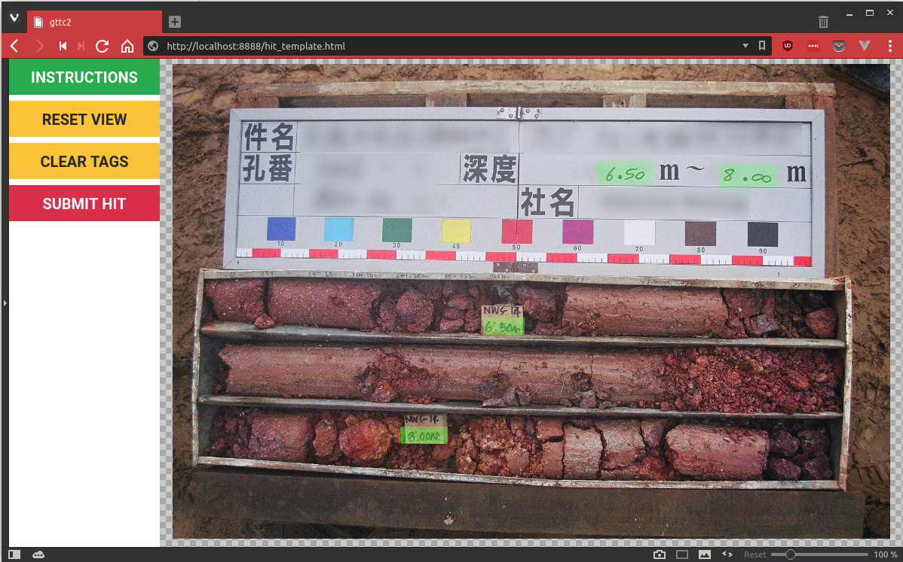

# MTURK Image Annotation

This repository contains code for an image annotation tool that can be hosted on [Amazon Mechanical Turk](https://www.mturk.com/). HITs can be created for a given set of images. This tool was originally developed as an alternative solution for [Newcrest's "Get to the Core II" challenge](https://unearthed.solutions/u/challenge/identify-depth-measurements-core-images).

